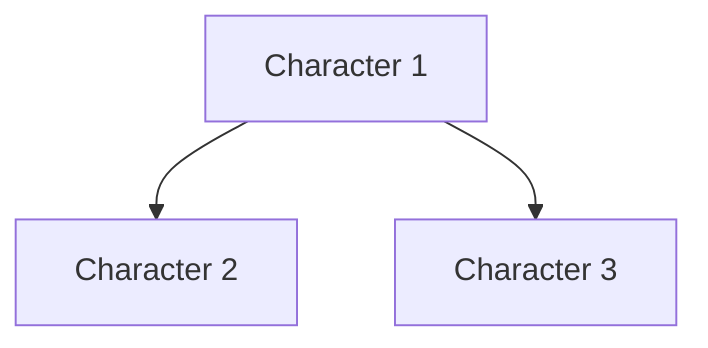

# Writer's Workflow - Complete Templates

Copy-paste ready templates for the Writer's Workflow. All fields are blank - fill them in with your own content.

---

## Table of Contents

1. [Daily Note Template](#daily-note-template)
2. [Project Dashboard](#project-dashboard)
3. [Character Note](#character-note)
4. [Scene Note](#scene-note)
5. [Plot Thread Note](#plot-thread-note)
6. [Research Note](#research-note)
7. [Location Note](#location-note)
8. [Writing Session Log](#writing-session-log)
9. [Theme Note](#theme-note)
10. [Revision Checklist](#revision-checklist)

---

## Daily Note Template

```markdown
# {{date:YYYY-MM-DD}}

## Ideas
-

## Writing Log
Words written:
Time spent:
Projects worked on:

## Observations
-

## Reading Notes
-
```

---

## Project Dashboard

```markdown
---
type: project
genre:
status:
word_count:
target:
deadline:
---

# Project - [Name]

## Current Focus

## Progress

## Key Links

## Active Scenes

## Research Needed

## Next Steps

---
**Created:**
**Last Updated:**
```

---

## Character Note

```markdown
---
type: character
project:
role:
status:
---

# [Character Name]

## Basic Info

## Physical Description

## Personality

## Backstory

## Character Arc

## Relationships

## Scenes Featuring This Character
```dataview
LIST
FROM "Projects/[Your Project]/Scenes"
WHERE contains(characters, "[Character Name]")
SORT file.name ASC
```

## Development Notes

## Quotes

**Related:**
```

---

## Scene Note

```markdown
---
type: scene
project:
chapter:
pov:
location:
timeline:
status:
word_count:
---

# Scene [Number] - [Title]

## Scene Goal

## POV Character

## Characters Present

## Setting

## Emotional Beat

## Key Events

## Draft

---

## Revision Notes

## Continuity Check

---
**Word Count:**
**First Draft:**
**Last Edited:**
```

---

## Plot Thread Note

```markdown
# Plot Thread - [Name]

## Description

## Scenes Where This Thread Appears
```dataview
LIST
FROM "Projects/[Your Project]/Scenes"
WHERE contains(plot_threads, "[thread-name]")
SORT file.name ASC
```

## Thread Arc

## Status

## Connected Threads

**Themes:**
```

---

## Research Note

```markdown
---
type: research
project:
topic:
source:
---

# Research - [Topic]

## Key Facts

## Relevant Details for Story

## Scenes Using This Research

## Source

---
**Related Research:**
```

---

## Location Note

```markdown
---
type: location
project:
district:
---

# Location - [Name]

## Physical Description

## Access

## Significance

## Scenes Set Here
```dataview
LIST
FROM "Projects/[Your Project]/Scenes"
WHERE location = "[Location Name]"
SORT file.name ASC
```

## Sensory Details

**Related Locations:**
```

---

## Writing Session Log

```markdown
# Writing Log - {{date:YYYY-MM-DD}}

**Project:**
**Time:**
**Duration:**

## What I Wrote

## Word Count

## Challenges

## Insights

## Next Session

---
**Mood:**
**Energy:**
```

---

## Theme Note

```markdown
# Theme - [Name]

## Central Question

## How This Appears in Story

## Scenes Exploring This Theme
```dataview
LIST
FROM "Projects/[Your Project]/Scenes"
WHERE contains(themes, "[theme-name]")
SORT file.name ASC
```

## Character Arcs Related to Theme

## Resolution

**Related Themes:**
```

---

## Revision Checklist

```markdown
# Revision Checklist - [Project]

## Structural Pass
- [ ]
- [ ]
- [ ]

## Character Pass
- [ ]
- [ ]
- [ ]

## Scene-Level Pass
- [ ]
- [ ]
- [ ]

## Line-Level Pass
- [ ]
- [ ]
- [ ]

## Continuity Pass
- [ ]
- [ ]
- [ ]

---
**Current Pass:**
**Deadline:**
```

---

## Character Relationship Map

```markdown
# Character Web - [Project]



## Relationships

## Conflicts
```

---

**That's it!** Copy any template, fill in your details, and start writing.
