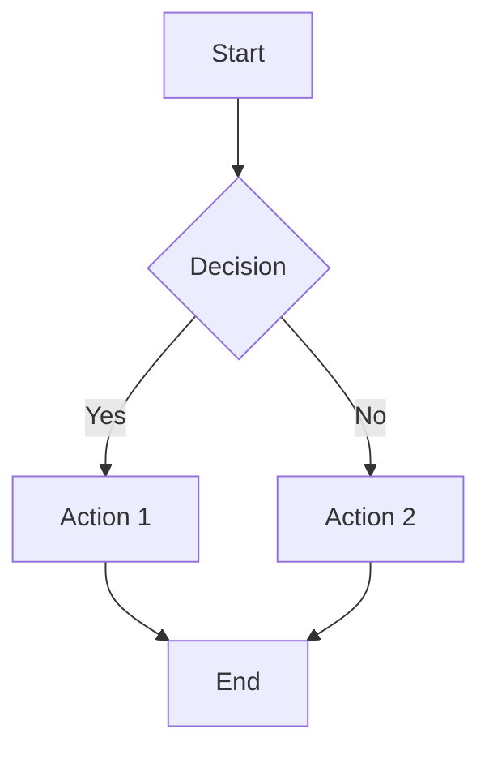
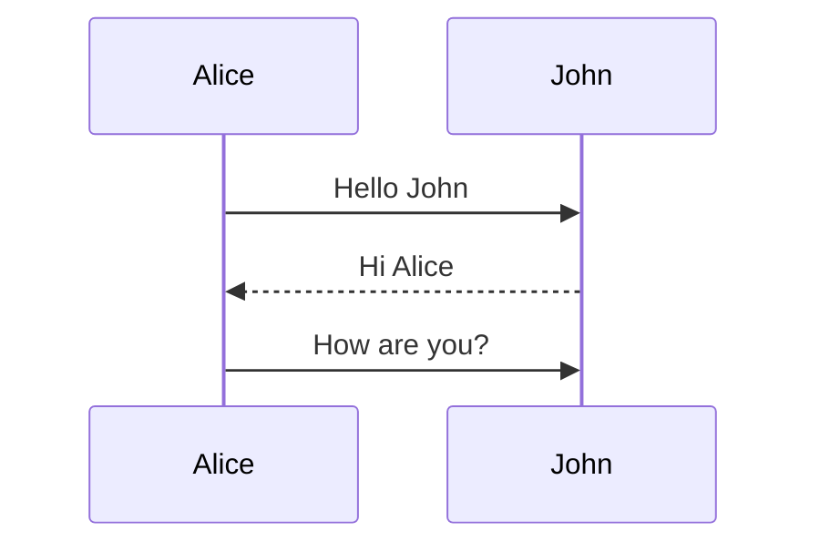
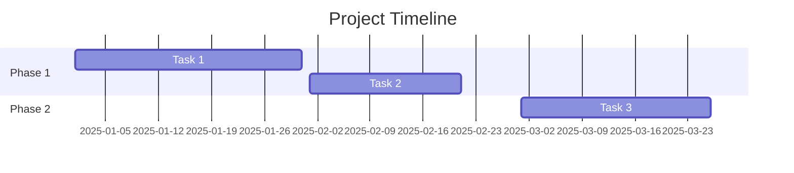

# Appendix A: Quick Reference - Markdown Syntax

**Everything you need to format notes in Obsidian.**

---

## Basic Formatting

### Headings

```markdown
# Heading 1
## Heading 2
### Heading 3
#### Heading 4
##### Heading 5
###### Heading 6
```

**Result:**

# Heading 1
## Heading 2
### Heading 3
#### Heading 4
##### Heading 5
###### Heading 6

---

### Text Emphasis

```markdown
**Bold text**
*Italic text*
***Bold and italic***
~~Strikethrough~~
==Highlight==
```

**Result:**

**Bold text**
*Italic text*
***Bold and italic***
~~Strikethrough~~
==Highlight==

---

### Lists

**Unordered:**

```markdown
- Item 1
- Item 2
  - Nested item 2a
  - Nested item 2b
- Item 3
```

**Result:**

- Item 1
- Item 2
  - Nested item 2a
  - Nested item 2b
- Item 3

---

**Ordered:**

```markdown
1. First item
2. Second item
   1. Nested item 2a
   2. Nested item 2b
3. Third item
```

**Result:**

1. First item
2. Second item
   1. Nested item 2a
   2. Nested item 2b
3. Third item

---

**Task Lists:**

```markdown
- [ ] Incomplete task
- [x] Completed task
- [ ] Another task
  - [ ] Nested subtask
```

**Result:**

- [ ] Incomplete task
- [x] Completed task
- [ ] Another task
  - [ ] Nested subtask

---

## Links

### Internal Links (Wikilinks)

```markdown
[[Note Name]]
[[Note Name|Display Text]]
[[Note Name#Heading]]
[[Note Name#Heading|Custom Text]]
```

**Examples:**

- `[[Project Alpha]]` → Links to "Project Alpha" note
- `[[Project Alpha|The Alpha Project]]` → Shows "The Alpha Project" as link text
- `[[Project Alpha#Budget]]` → Links to Budget section in Project Alpha
- `[[Project Alpha#Budget|See budget]]` → Custom text to section link

---

### External Links

```markdown
[Link Text](https://example.com)
<https://example.com>
```

**Examples:**

- `[Google](https://google.com)` → Google
- `<https://google.com>` → https://google.com

---

### Linking to Blocks

```markdown
[[Note Name#^block-id]]
```

**Create block ID:**

```markdown
This is a paragraph with a block ID. ^my-block-id
```

**Link to it:**

```markdown
See [[Note Name#^my-block-id]]
```

---

## Embeds

### Embed Notes

```markdown
![[Note Name]]
![[Note Name#Heading]]
```

**Embeds entire note or specific section.**

---

### Embed Images

```markdown
![[image.png]]
![[image.png|200]]
![[image.png|200x100]]
```

**Examples:**

- `![[photo.jpg]]` → Full size image
- `![[photo.jpg|300]]` → 300px wide
- `![[photo.jpg|300x200]]` → 300px wide, 200px tall

---

### Embed External Images

```markdown

```

---

### Embed PDFs

```markdown
![[document.pdf]]
![[document.pdf#page=5]]
```

**Second example opens to page 5.**

---

## Code

### Inline Code

```markdown
Use `inline code` for short snippets.
```

**Result:** Use `inline code` for short snippets.

---

### Code Blocks

````markdown
```
Basic code block
No syntax highlighting
```
````

**Result:**

```
Basic code block
No syntax highlighting
```

---

**With syntax highlighting:**

````markdown
```javascript
function hello() {
  console.log("Hello world");
}
```
````

**Result:**

```javascript
function hello() {
  console.log("Hello world");
}
```

**Supported languages:** javascript, python, java, css, html, bash, sql, json, yaml, and many more.

---

## Tables

### Basic Table

```markdown
| Column 1 | Column 2 | Column 3 |
| -------- | -------- | -------- |
| Data 1   | Data 2   | Data 3   |
| Data 4   | Data 5   | Data 6   |
```

**Result:**

| Column 1 | Column 2 | Column 3 |
| -------- | -------- | -------- |
| Data 1   | Data 2   | Data 3   |
| Data 4   | Data 5   | Data 6   |

---

### Table Alignment

```markdown
| Left align | Center align | Right align |
| :--------- | :----------: | ----------: |
| Left       | Center       | Right       |
| Text       | Text         | Text        |
```

**Result:**

| Left align | Center align | Right align |
| :--------- | :----------: | ----------: |
| Left       | Center       | Right       |
| Text       | Text         | Text        |

**Alignment:**
- `:---` → Left aligned
- `:---:` → Center aligned
- `---:` → Right aligned

---

## Blockquotes

### Basic Blockquote

```markdown
> This is a blockquote.
> It can span multiple lines.
```

**Result:**

> This is a blockquote.
> It can span multiple lines.

---

### Nested Blockquotes

```markdown
> Level 1 quote
>> Level 2 nested quote
>>> Level 3 nested quote
```

**Result:**

> Level 1 quote
>> Level 2 nested quote
>>> Level 3 nested quote

---

## Horizontal Rules

```markdown
---

***

___
```

**All three create horizontal line:**

---

---

## Callouts (Obsidian-Specific)

### Basic Callout

```markdown
> [!note]
> This is a note callout.
```

**Result:**

> [!note]
> This is a note callout.

---

### Callout Types

```markdown
> [!note]
> Note callout

> [!abstract]
> Abstract/Summary callout

> [!info]
> Info callout

> [!tip]
> Tip callout

> [!success]
> Success callout

> [!question]
> Question callout

> [!warning]
> Warning callout

> [!failure]
> Failure callout

> [!danger]
> Danger callout

> [!bug]
> Bug callout

> [!example]
> Example callout

> [!quote]
> Quote callout
```

---

### Callout with Title

```markdown
> [!tip] Custom Title Here
> Content of the callout.
```

---

### Foldable Callout

```markdown
> [!note]- Foldable (collapsed by default)
> Hidden content

> [!note]+ Foldable (expanded by default)
> Visible content
```

**Use `-` for collapsed, `+` for expanded.**

---

## Tags

### Inline Tags

```markdown
#tag
#nested/tag
#tag-with-dashes
```

**Examples:**

- `#project` → Simple tag
- `#project/alpha` → Nested tag
- `#work-in-progress` → Tag with dashes

**Rules:**
- No spaces (use dashes or underscores)
- Can nest with `/`
- Case sensitive

---

### Frontmatter Tags

```markdown
---
tags:
  - tag1
  - tag2
  - nested/tag
---
```

---

## Frontmatter (YAML)

### Basic Frontmatter

```markdown
---
title: Note Title
date: 2025-10-03
author: Your Name
---

# Note content starts here
```

**Must be at very top of note, enclosed in `---`**

---

### Common Properties

```markdown
---
title: Note Title
date: 2025-10-03
tags:
  - tag1
  - tag2
status: draft
priority: high
---
```

**Use any properties you want. These are examples.**

---

## Comments

### HTML Comments (Hidden in Preview)

```markdown
<!-- This is a comment. It won't appear in preview mode. -->
```

---

### Obsidian Comments

```markdown
%%
This is an Obsidian comment.
It won't appear in preview.
Can span multiple lines.
%%
```

---

## Footnotes

### Creating Footnotes

```markdown
Here's a sentence with a footnote.[^1]

Here's another with a longer reference.[^longnote]

[^1]: This is the footnote content.

[^longnote]: This is a longer footnote.
    It can have multiple paragraphs.

    And multiple lines.
```

**Footnotes appear at bottom of note in preview.**

---

## Math (LaTeX)

### Inline Math

```markdown
Einstein's equation: $E = mc^2$
```

**Result:** Einstein's equation: $E = mc^2$

---

### Block Math

```markdown
$$
\frac{-b \pm \sqrt{b^2 - 4ac}}{2a}
$$
```

**Result:**

$$
\frac{-b \pm \sqrt{b^2 - 4ac}}{2a}
$$

**Requires LaTeX knowledge. See LaTeX documentation for syntax.**

---

## Diagrams (Mermaid)

### Flowchart

````markdown

````

---

### Sequence Diagram

````markdown

````

---

### Gantt Chart

````markdown

````

**See Mermaid documentation for full syntax.**

---

## Obsidian-Specific Features

### Aliases

```markdown
---
aliases:
  - Alternate Name
  - Another Name
---
```

**Use `[[Alternate Name]]` to link to this note.**

---

### Backlinks

**No special syntax needed.**

When you link `[[Note A]]` from Note B, Note A automatically shows Note B in backlinks panel.

---

### Unlinked Mentions

**Obsidian automatically finds notes that mention current note's title, even without links.**

View in right sidebar → Backlinks → Unlinked mentions

---

## Advanced Formatting

### Multi-Column Layout (with CSS)

```markdown
<div class="multi-column">

Column 1 content here.

</div>

<div class="multi-column">

Column 2 content here.

</div>
```

**Requires custom CSS snippet. See Chapter 17.**

---

### Centered Text

```markdown
<center>
This text is centered.
</center>
```

---

### Superscript and Subscript

```markdown
X<sup>2</sup> (superscript)
H<sub>2</sub>O (subscript)
```

**Result:** X<sup>2</sup> and H<sub>2</sub>O

---

## Keyboard Shortcuts for Formatting

**Windows/Linux:**

- `Ctrl + B` → Bold
- `Ctrl + I` → Italic
- `Ctrl + K` → Insert link
- `Ctrl + E` → Toggle edit/preview

**Mac:**

- `Cmd + B` → Bold
- `Cmd + I` → Italic
- `Cmd + K` → Insert link
- `Cmd + E` → Toggle edit/preview

**See Appendix B for complete shortcut list.**

---

## Quick Tips

1. **Preview while typing:** Toggle Live Preview mode (Settings → Editor)
2. **Paste images:** Drag-drop or Ctrl+V pastes into vault
3. **Copy as HTML:** Right-click in preview → Copy as HTML
4. **Export:** Right-click note → Export to PDF
5. **Spell check:** Right-click word → Spelling suggestions

---

## Common Mistakes

### Mistake 1: Spaces in wikilinks

**Wrong:** `[[ Note Name ]]`
**Right:** `[[Note Name]]`

**No spaces between brackets and note name.**

---

### Mistake 2: Forgetting closing brackets

**Wrong:** `[[Note Name`
**Right:** `[[Note Name]]`

---

### Mistake 3: Wrong code block syntax

**Wrong:**
```
'''javascript
code here
'''
```

**Right:**
````
```javascript
code here
```
````

**Use backticks (`) not apostrophes (').**

---

### Mistake 4: Frontmatter not at top

**Wrong:**

```markdown
# Note Title

---
tags: [tag1]
---
```

**Right:**

```markdown
---
tags: [tag1]
---

# Note Title
```

**Frontmatter must be first thing in file.**

---

## Testing Your Markdown

**Create a test note with various formatting:**

1. Create new note: "Markdown Test"
2. Copy examples from this appendix
3. Toggle between edit and preview mode
4. Verify rendering

**Practice until formatting becomes automatic.**

---

## External Resources

**Complete Markdown guides:**

- Obsidian Help: `help.obsidian.md/Editing+and+formatting`
- Markdown Guide: `markdownguide.org`
- CommonMark Spec: `commonmark.org`

---

**This appendix covers 95% of markdown you'll use in Obsidian.**

**Bookmark this page. Reference it when you forget syntax.**
